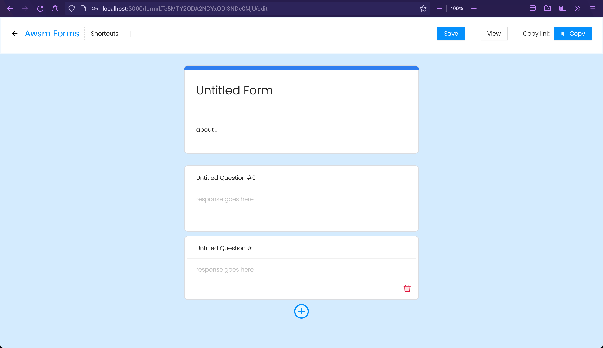

# Forms

Create forms, record responses.

  

## Overview


Note: This application is in development

---

## Build instructions

### Clone the repository:

```sh
git clone https://github.com/jayanpraveen/forms.git
```

### Build using maven:

```sh
mvn clean install
```

---

For using the development server, go to [./src/main/react](https://github.com/jayanpraveen/Forms/tree/main/src/main/react) and start the server using:

```sh
yarn start
```

> This will start server at port 3000, you will also need to run the Spring boot application.
